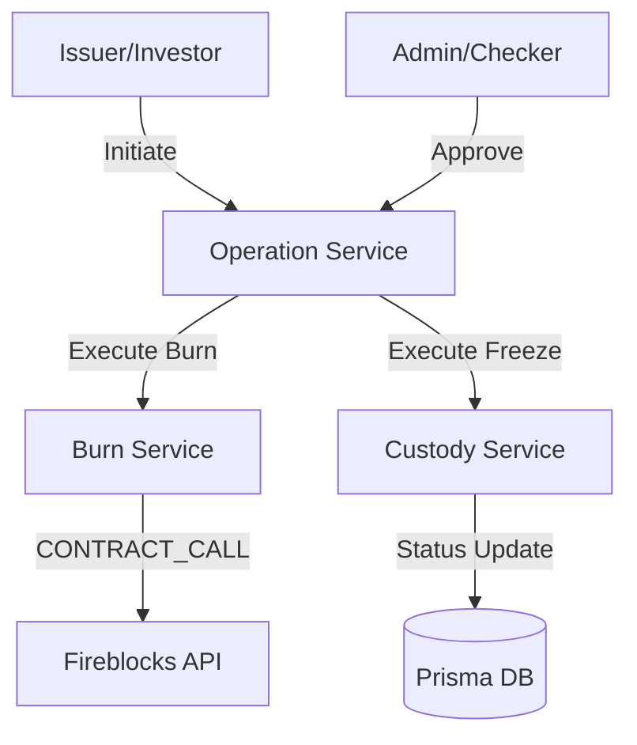

# Token Operations: Burning & Freezing

This document details the implementation of token burning (on-chain) and token freezing (internal) within the AssetLink Custody platform.

## 1. Overview & Purpose

The platform now supports advanced token lifecycle management beyond simple minting:
- **Token Burning**: Permanently destroys tokens on-chain by calling the `burn` function of the smart contract. This is used for redemptions or supply adjustments.
- **Token Freezing**: Suspends all platform-level operations for a specific asset by transitioning it to a `FROZEN` state. This is an internal administrative control.

---

## 2. Architecture & Design

The operations follow the platform's **Maker-Checker** security model while providing **Direct Execution** capabilities for super-admins.

### Component Diagram


---

## 3. Token Burning (On-Chain)

Burning tokens requires interacting with the blockchain. We use Fireblocks `CONTRACT_CALL` combined with `ethers.js` for ABI encoding.

### Core Function: `burnToken`
**File**: `src/modules/token-lifecycle/burn.service.js`

#### Logic Snippet:
```javascript
// Encode the burn function call
const iface = new ethers.Interface(["function burn(uint256 amount)"]);
const amountInWei = ethers.parseUnits(amount.toString(), decimals); 
const callData = iface.encodeFunctionData("burn", [amountInWei]);

// Construct Fireblocks transaction
const payload = {
    operation: "CONTRACT_CALL",
    assetId: blockchainId, 
    source: { type: "VAULT_ACCOUNT", id: String(vaultId) },
    destination: {
        type: "ONE_TIME_ADDRESS",
        oneTimeAddress: { address: contractAddress }
    },
    extraParameters: { contractCallData: callData }
};

// Submit via manual HTTPS request
const result = await fireblocksClient.makeFireblocksRequest('/v1/transactions', 'POST', payload);
```

> **Note**: Just like the minting process, all on-chain operations (Mint, Burn, Transfer) now use the **Standard Transaction API (/v1/transactions)** for monitoring. We have retired the specialized Tokenization API for custom ERC20F tokens to ensure consistent finality tracking and full traceability of transaction hashes.

---

## 4. Token Freezing (Internal)

Freezing is handled internally by the platform. A frozen asset cannot be transferred or withdrawn until it is unfrozen.

### Core Function: `freezeToken`
**File**: `src/modules/custody/custody.service.js`

#### Logic Snippet:
```javascript
export const freezeToken = async (id, actor, context = {}) => {
    // Transition status from MINTED to FROZEN
    const updated = await updateCustodyStatus(
        id,
        CustodyStatus.FROZEN,
        { frozenAt: new Date(), frozenBy: actor },
        actor,
        context
    );
    return updated;
};
```

---

## 5. Working Flows

### Case 1: Maker-Checker Flow (Standard)
1. **Initiate**: A User (Issuer/Investor) requests a burn/freeze via:
   - `POST /v1/operations/burn`
   - `POST /v1/operations/freeze`
2. **Review**: The operation enters `PENDING_CHECKER` status.
3. **Approve**: An Admin (Checker) approves the operation.
4. **Execution**: The system automatically triggers the `executeOperation` logic which calls the respective Burn or Custody service.

### Case 2: Admin Direct Execution
Admins can bypass the approval queue for urgent actions:
1. **Call**: `POST /v1/operations/admin/burn` or `POST /v1/operations/admin/freeze`.
2. **Logic**: The `executeDirectOperation` helper in `OperationService` performs both Initiation and Approval in a single atomic flow (Maker-Checker bypass).

---

## 6. API Endpoints Summary

| Feature | Method | Endpoint | Auth | Role |
| :--- | :--- | :--- | :--- | :--- |
| **Request Burn** | `POST` | `/v1/operations/burn` | HMAC/JWT | Maker |
| **Request Freeze** | `POST` | `/v1/operations/freeze` | HMAC/JWT | Maker |
| **Direct Burn** | `POST` | `/v1/operations/admin/burn` | HMAC | Admin |
| **Direct Freeze** | `POST` | `/v1/operations/admin/freeze` | HMAC | Admin |

---

## 7. Audit Logging
Every action (Initiate, Approve, Direct Execution) creates an immutable record in the `AuditLog` table, capturing:
- `actor`: Identity of the requester/approver.
- `eventType`: `TOKEN_BURNED`, `TOKEN_FROZEN`, `OPERATION_APPROVED`, etc.
- `metadata`: Transaction IDs, amounts, and timestamps.
